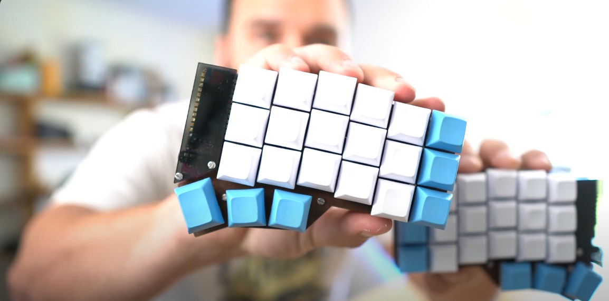

## Usando un teclado mecánico dividido

Mientras navegaba por internet en busca de temas de informática, me encontré con el canal de "Hola Mundo," presentado por Nicolás Schurmann, un programador de origen chileno que trabaja en Nueva Zelanda. Este canal destaca por su gran calidad audiovisual y su enfoque en la programación.

Un día, mientras veía sus videos, algo llamó mi atención: su teclado. Era un teclado pequeño, sin etiquetas en las teclas para indicar cuál era cada una, y lo más curioso, estaba dividido en dos partes.

Se trataba del teclado Corne, un proyecto de Foostan. Tiempo después, tuve la oportunidad de adquirir uno, aunque adaptarme a este teclado presentó una gran curva de aprendizaje.

## Disposición ortolineal
La disposición de las teclas es diferente. Mientras que los teclados convencionales tienen un ligero desplazamiento entre filas, en este teclado las teclas están alineadas de forma recta, lo que permite seguir la línea natural de los dedos al escribir. Adaptarse a esta disposición desde un teclado convencional puede ser un desafío, pero, una vez acostumbrado, resulta muy cómodo (personalmente, me parece increíblemente cómodo).

## Empezar con mecanografía y corregir malas prácticas
Con un teclado dividido y sin las letras visibles en cada tecla, lo vi como una oportunidad para mejorar mi mecanografía. Spoiler: fue toda una odisea.

Comencé con sitios web como Monkeytype o TypingClub, que me enseñaron a colocar correctamente las manos en la línea central y a asignar cada grupo de teclas a un dedo específico. Empecé muy despacio, escribiendo apenas 7 palabras por minuto, y practicando diariamente hasta desarrollar suficiente memoria muscular para escribir sin ver el teclado, o al menos mirándolo solo ocasionalmente.

Este proceso también me ayudó (y sigue ayudándome) a corregir malas prácticas. Por ejemplo, para escribir la "B", el dedo correcto es el índice de la mano izquierda, pero yo solía invadir el espacio de la otra mano y escribirla con la derecha, lo que generaba una carga desigual de trabajo entre ambas manos.

Con un teclado dividido, esa invasión de la otra mano se vuelve incómoda, lo que me obliga a respetar la asignación de cada tecla a su dedo y mano correspondiente. Esto ha hecho que mi escritura sea más rápida y consistente.

## Sistema de capas y máxima personalización

Como mencioné antes, en este teclado cada dedo tiene asignadas ciertas teclas, pero uno en particular se lleva la peor parte: el meñique de la mano izquierda. Este dedo controla casi todos los símbolos y teclas esenciales como Enter o Borrar. Para quienes programamos y usamos frecuentemente estos símbolos, el meñique soporta mucha carga.

Para aliviar esto, el teclado utiliza un sistema de capas. En mi capa principal, tengo una disposición de teclado QWERTY en inglés. Al presionar la tecla de capa, puedo acceder a los números y funciones como subir, bajar o silenciar el volumen. En la segunda capa tengo los símbolos que normalmente requerirían la tecla Shift y los números superiores, así como una distribución más cómoda para corchetes, llaves, barra invertida, entre otros.

## La mayor ventaja: Ergonomía
Paso mucho tiempo frente a una computadora, y mantener una postura antinatural con un teclado convencional afecta a mis muñecas, incluso aunque haga ejercicio. Este teclado me permite ajustar libremente la separación de las manos y el ángulo de las muñecas, lo cual reduce la tensión en ellas. Aunque el beneficio no es inmediato, a largo plazo ha mejorado mucho mi comodidad y ha disminuido la tensión en mis muñecas.

## Curva de aprendizaje
El mayor reto de este teclado (y posiblemente de cualquiera similar) es el tiempo de adaptación. Incluso si tienes las letras visibles en las teclas, el cambio a una disposición diferente y el uso del sistema de capas para escribir o programar requiere un periodo de ajuste.

Después de un tiempo usándolo, los beneficios son evidentes: las manos se mueven menos y se logra una mayor comodidad en el entorno de estudio o trabajo.